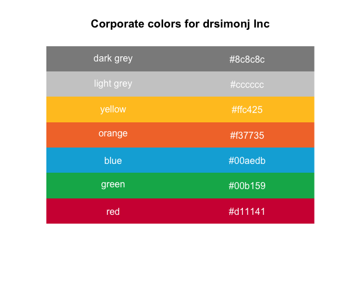

# Introduction

This package was based on a blog post a read on r-bloggers.com [see](https://www.r-bloggers.com/creating-corporate-colour-palettes-for-ggplot2/) . When I was making this package I also had a look at ggthemes.

I hope that I found now some nice colors and also want to create a nice theme for CPM.



# Installation

Install with `devtools::install_github("ricoderks/ggCPM")`.

# Use

## Colors

There are 5 different palettes:

- mian: blue, green, yellow
- cool: blue, green
- hot: yellow, orange, red
- mixed: blue, green, yellow, orange, red
- grey: light grey, dark greay

Using the CPM colors (discrete values):

```r
ggplot(data = mtcars,
       aes(x = wt,
           y = mpg)) +
geom_point(aes(colour = as.factor(gear))) +
scale_color_cpm(palette = "main")
```

Using the CPM colors (continuous values):

```r
ggplot(data = mtcars,
       aes(x = wt,
           y = mpg)) +
geom_point(aes(colour = gear)) +
scale_color_cpm(palette = "main",
                discrete = FALSE)
```

## Theme

The CPM theme is based on theme_minimal from ggplot2. For now only the panel background, strip background and strip text are modified.

```r
ggplot(data = mtcars,
       aes(x = wt,
           y = mpg)) +
geom_point(aes(colour = as.factor(gear))) +
scale_color_cpm(palette = "main") +
theme_cpm()
```

If you need to modify something else in the theme do this after you call theme_cpm()

```r
ggplot(data = mtcars,
       aes(x = wt,
           y = mpg)) +
geom_point(aes(colour = as.factor(gear))) +
scale_color_cpm(palette = "main") +
theme_cpm() +
theme(axis.text.x = element_text(size = 6))
```
